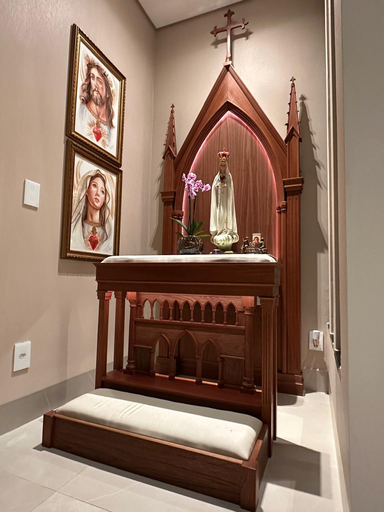
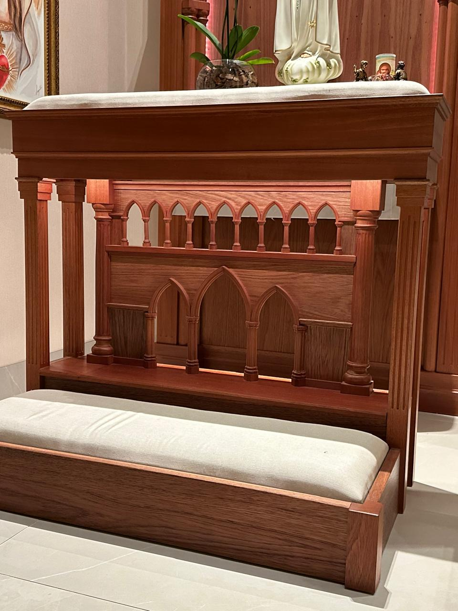
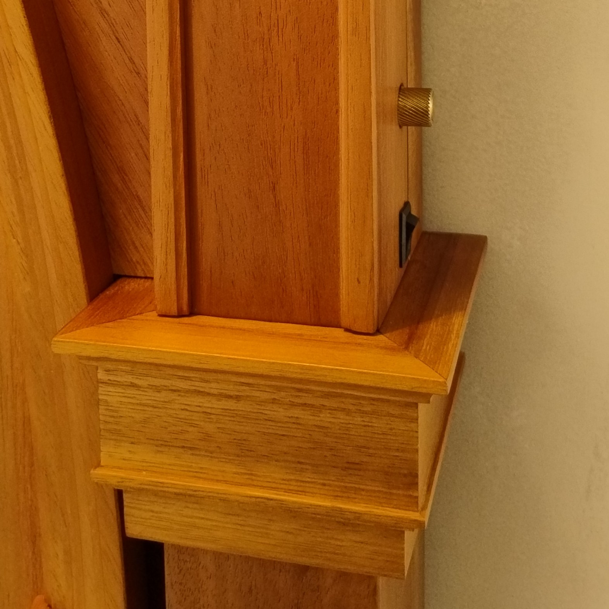

## Aluizio Tomazelli

Woodworker & machinist.  
Maker & programmer by enthusiasm and necessity.

Working with ESP32, C++, and IoT systems.

### Projects

[WiFi Manager](https://github.com/aluiziotomazelli/wifi_manager) - ESP-IDF component (Espressif Registry)  
[smart-farm](https://github.com/aluiziotomazelli/smart-farm) - WIP - Smart Solar Load Management System, ESP-NOW communication protocol  
[led_lamp](https://github.com/aluiziotomazelli/led_lamp) - WS2812 addressable lighting for liturgical oratories, including a realistic candle effect.

Smart devices - Hardware + firmware integration

### Skills

Woodworking - Machinist  
C/C++ - ESP-IDF - IoT - Hardware Integration

### Currently

Learning embedded testing - Building agricultural IoT systems
 
 ---

### Featured Projects:

#### Gothic household altar with prie-dieu
> *“Wood structure replicating the stone Gothic cathedrals built by — undegreed — master builders.”*

This project merges Gothic sacred woodworking with modern automation technology.
* **Wireless Sync:** Altar and prie-dieu lighting synchronized via **ESP_NOW**.
* **Custom Hardware:** Rotary encoders featuring **custom machined brass knobs** for control.
* **Craftsmanship:** Woodworking in **spanish cedar** (*Cedrela odorata*) that seeks to replicate, as faithfully as possible, the architecture of **ancient Gothic cathedrals**.

- [Repo: led_lamp](https://github.com/aluiziotomazelli/led_lamp)

 

Gothic household and prie-dieu lighting synchronized via ESP_NOW

Gothic prie-dieu lighting

Custom-made brass rotary encoder knob

---
#### WiFi Manager ESP-IDF component (Espressif Registry)

- [Dev.to wifi_manager](https://dev.to/aluiziotomazelli/wifimanager-a-wi-fi-state-manager-for-esp-idf-ejg)

- [wifi_manager](https://github.com/aluiziotomazelli/wifi_manager)

- [WiFiManager ESP-IDF component](https://components.espressif.com/components/aluiziotomazelli/wifi_manager/versions/1.0.0/readme)

---