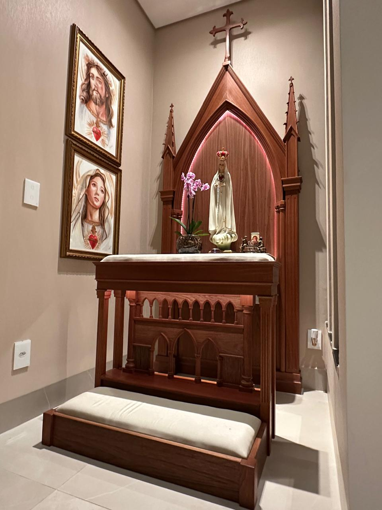
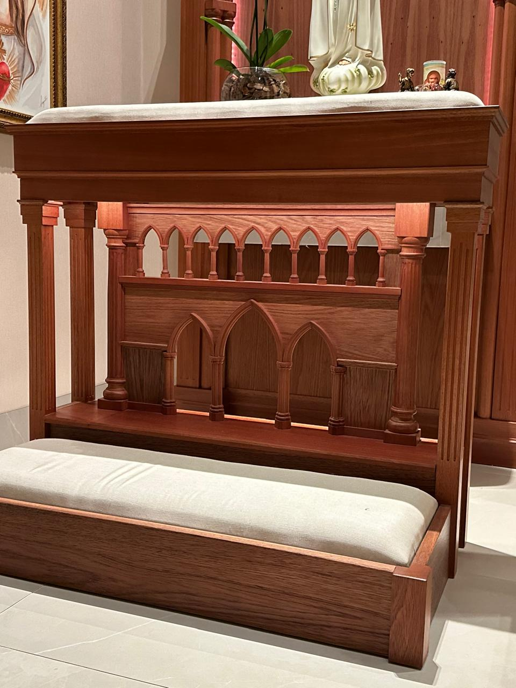
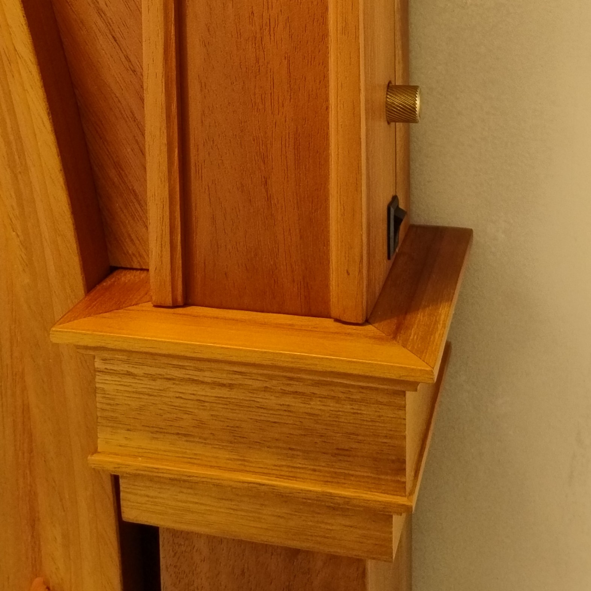

## Aluizio Tomazelli

Woodworker & machinist by trade. Maker & programmer by enthusiasm and necessity.

I build furniture meant to last decades — pieces designed with the same attention to detail and longevity I try to bring to firmware. Most of what I program starts as a real problem: a washing machine with a burned control board, a small farm that needed automation, a Gothic altar that needed wireless lighting.

Working with ESP32, C++, and ESP-IDF. Focused on clean component architecture, unit testing with GoogleTest/GMock, and CI with GitHub Actions.

---

### Projects

#### 🧪 GTest with ESP-IDF — tutorial series
A step-by-step guide to integrating GoogleTest into ESP-IDF for host-based unit testing — no board, no flashing, just fast feedback. Covers the GTest wrapper, `esp_err_t` integration, GMock, hardware abstraction, and CI with the official Espressif container.

- [gtest-esp-idf](https://github.com/aluiziotomazelli/gtest-esp-idf)

#### 📡 Ultrasonic Sensor — ESP-IDF component
A mature HC-SR04 driver built as a proper ESP-IDF component with interfaces, clean architecture, and GoogleTest/GMock host tests running in CI.

- [ultrasonic_sensor](https://github.com/aluiziotomazelli/ultrasonic_sensor)

#### 📶 WiFi Manager — ESP-IDF component (Espressif Registry)
A Wi-Fi state manager for ESP-IDF, published on the Espressif Component Registry. Fully refactored with C++ classes and single responsibility.

- [wifi_manager](https://github.com/aluiziotomazelli/wifi_manager)
- [Espressif Registry](https://components.espressif.com/components/aluiziotomazelli/wifi_manager/versions/1.0.0/readme)
- [Dev.to article](https://dev.to/aluiziotomazelli/wifimanager-a-wi-fi-state-manager-for-esp-idf-ejg)

#### 🔋 Power Control

A component for controlling power to external devices via GPIO, specifically designed for sensor applications in low-power systems.

- [power_control](https://github.com/aluiziotomazelli/power_control)

#### 📻 ESP-NOW Manager

ESP-NOW communication layer for ESP32 devices that provides reliable, structured communication built on top of ESP-NOW (Espressif's low-power, peer-to-peer wireless protocol). Automatic pairing (no need of hardcoded MAC), peer management, node scan for correct HUB channel.

- [espnow_manager](https://github.com/aluiziotomazelli/espnow_manager)

#### 🌱 Smart Farm — WIP
Solar load management system using ESP-NOW. The components above were built for this project — they'll be integrated as dependencies once mature.

- [smart-farm](https://github.com/aluiziotomazelli/smart-farm)

---

### Featured build: Gothic household altar with prie-dieu

> *"Wood structure replicating the stone Gothic cathedrals built by — undegreed — master builders."*

Spanish cedar woodworking that seeks to replicate, as faithfully as possible, the architecture of ancient Gothic cathedrals — combined with modern wireless automation.

- **Wireless sync:** Altar and prie-dieu lighting synchronized via ESP-NOW
- **Custom hardware:** Rotary encoders with custom machined brass knobs
- **Firmware:** [led_lamp](https://github.com/aluiziotomazelli/led_lamp) — WS2812 addressable lighting with a realistic candle effect

*Gothic household altar and prie-dieu — lighting synchronized via ESP-NOW*

*Gothic prie-dieu lighting*

*Custom-made brass rotary encoder knob*

---

### Skills

`C++` · `ESP-IDF` · `ESP32` · `GoogleTest` · `GMock` · `FreeRTOS` · `ESP-NOW` · `CMake` · `GitHub Actions` · `IoT` · `Woodworking` · `Machining`

---

### Currently

Building the `gtest-esp-idf` tutorial series · Refactoring components with clean architecture and host-based tests · Open to freelance work in ESP32 firmware development and code refactoring
